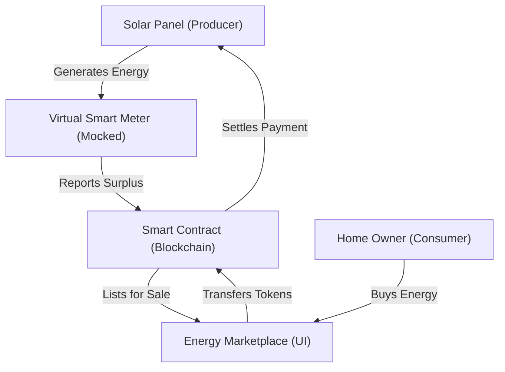

# Platform Architecture: P2P Energy Trading

This document explains how the system works for a non-coder.

## 1. The Big Picture
Imagine a marketplace like Amazon, but instead of books, people are selling electricity from their solar panels. 

## 2. Component Breakdown

### A. The Ledger (Blockchain)
This is the "Truth." It records exactly who generated how much energy and who bought it.
- **Real Feature:** We use a Smart Contract to ensure no one can cheat the numbers.

### B. The Brain (Marketplace Contract)
This matches sellers with buyers.
- **Real Feature:** It handles the money (Tokens) and ensures the Seller gets paid only when the Buyer receives the energy.

### C. The Interface (Frontend)
What you see on your screen.
- **User Task:** You provide the design/UI.
- **My Task:** I connect your buttons to the Blockchain "Brain."

### D. The Simulator (IoT Mocking)
Since we aren't connecting real solar panels today, I will build a "Simulator."
- **Mock Feature:** A small piece of code that pretends to generate 5kWh of solar power every minute so you can see the graphs move on the dashboard.

## 3. Why this is Secure?
Because we use **Smart Contracts**, no central company controls the energy. It is truly Peer-to-Peer.
Every transaction is signed by your Digital Wallet (like MetaMask).
