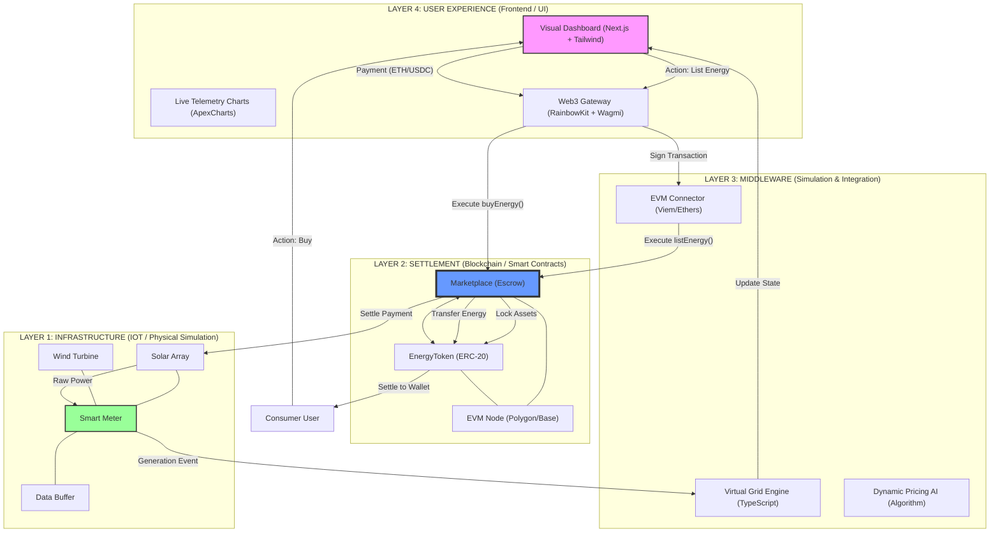

# The Omni-Architecture: P2P Energy Grid Matrix

This is the unified "Master Blueprint." It visualizes the system both **Vertically** (from hardware to cloud) and **Horizontally** (from producer to consumer).

## 1. The Full Stack Matrix (Single Unified Diagram)

---

## 2. The Tech Stack Deep-Dive (Matrix View)

| Dimension | Technology | Role |
| :--- | :--- | :--- |
| **Logic (The Brain)** | Solidity 0.8.20 | Secure, immutable escrow and token management. |
| **Interface (The Face)** | Next.js 14 | High-performance, SEO-friendly React framework. |
| **Auth (The Access)** | ECDSA Crypto | Wallet-based authentication; no passwords required. |
| **Mocking (The Reality)** | TypeScript Logic | Real-time trigonometric simulation of energy peak/trough. |
| **Visuals (The Vibe)** | Tailwind CSS | Science-fiction "Glassmorphism" UI design. |

---

## 3. The "Unfair Advantage" (USPs)
1.  **Peer-to-Peer Directness:** No utility companies taking a 30% cut.
2.  **Instant Settlement:** Sellers get paid the exact second the energy is sold.
3.  **Proof of Green:** Automated generation of NFT certificates for every MWh.
4.  **Hardware Agnostic:** Can be connected to any meter (or our simulator) via API.

---

## 4. Operational Flow (Horizontal logic)
1.  **Generate:** Producer (Solar) generates 5kWh. Smart Meter logs it.
2.  **Verify:** Virtual Grid Engine validates the production.
3.  **List:** Producer signs a transaction listing 5kWh at 0.05 ETH/unit.
4.  **Match:** Consumer sees the listing on the dashboard and clicks "Buy."
5.  **Execute:** Smart Contract handles the simultaneous swap: ETH to Seller, ETK to Buyer.
